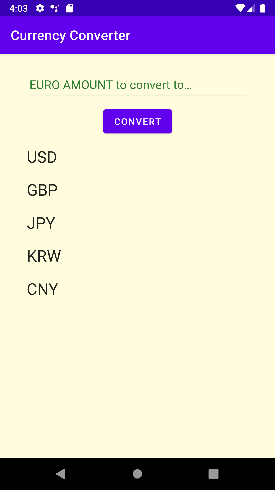
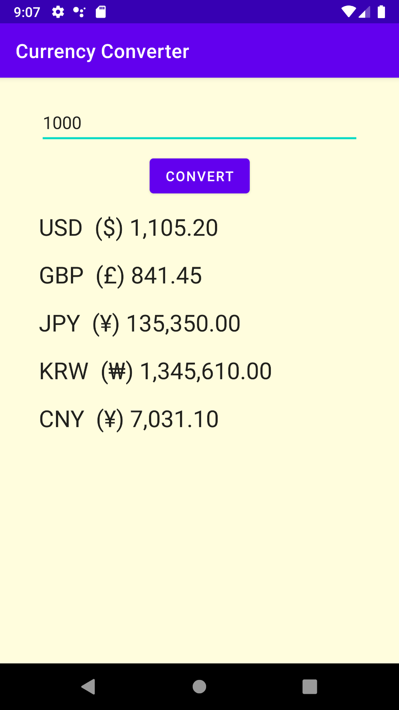

Date: 1.April.2022  
Android App: Currency Converter  
(amount of Euro to USD, GBP, JPY ...)  
 
Tools: Bumblebee 2021.1.1  
With JAVA  

Permission:  
  - "android:permission:INTERNET"  
    
Dependency (Volley):   
   - implementation 'com.android.volley:volley:1.2.1'

Currency exchange rate source: 
   - https://www.ecb.europa.eu/stats/eurofxref/eurofxref-daily.xml  

Network setting:
  - android:usesCleartextTraffic="true"
  - android:networkSecurityConfig="@xml/network_security_config"

Demo views  

  
  
volley ref:
https://www.androidtonight.com/2019/07/android-xml-parsing-by-volley-example_7.html
  
