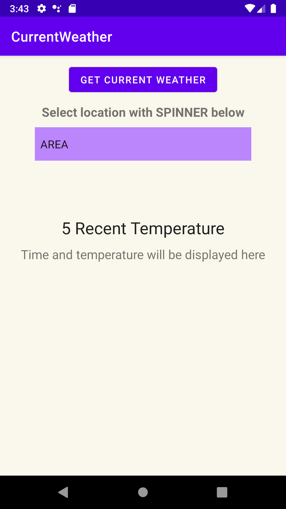
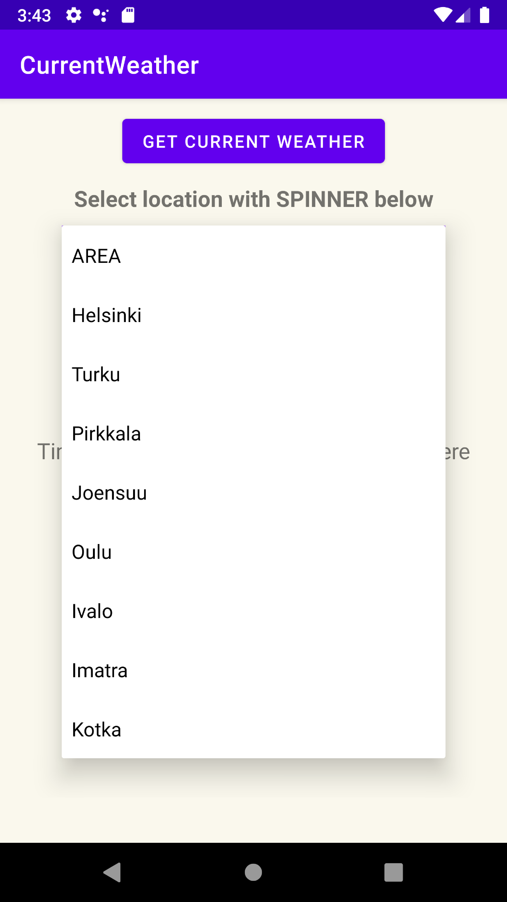
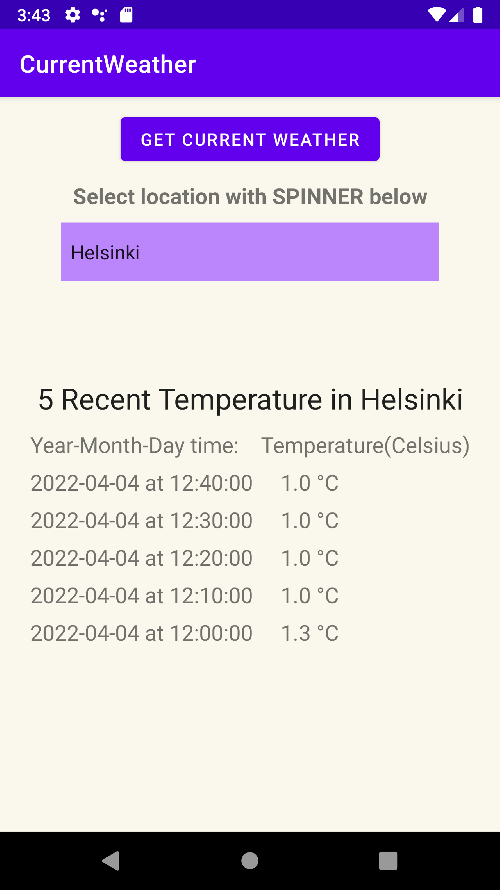

Date 4.4.2022  
App: CurrentWeather get recent air temperature from selected region   

Tools: Bumblebee 2021.1.1 (with JAVA)   
Library: Volley 1.2.1  


Features (MainActivity):  
  -  Spinner to select region (list of city)  
  -  Button to get data from service site (opendata.fmi.fi)  
  -  TextView to display recent temperature   

Target url: place = user input & paramter = temperature(t2m)     
http://opendata.fmi.fi/wfs/fin?service=WFS&version=2.0.0&request=getFeature&storedquery_id=fmi::observations::weather::timevaluepair&place=Helsinki&parameters=t2m&

    
**Demo views**  




<br />    
    
**Harjoitus 18 – Säätila nyt**   
Ilmatieteenlaitoksen Opendata.fmi.fi – palvelun tarjoamaa tietoa.  
   - Käyttäjä voi valita/kirjoittaa halutun sijainnin (Esim spinner tai textEdit -komponentti)
   - Sovellus hakee viisi tuoreinta lämpötilaa ilmatieteenlaitoksen palvelusta.
   - Lämpötilat näytetään ruudulla mittausajan kanssa
   - https://www.ilmatieteenlaitos.fi/latauspalvelun-pikaohje


**Harjoitus 19 – Tietoa Widgettiin**  
Tässä tavoitteena on luoda tietoa esittävä Widget – mobiililaitteen ruudulle.
• Esitettävä tieto voi olla valuuttakursseja tai säätieto.
• Eli tavoitteena on hyödyntää harjoituksen 17 tai 18 datasisältöä.
• https://developer.android.com/codelabs/advanced-android-training-widgets?index=..
%2F..advanced-android-training#0
• https://developer.android.com/guide/topics/appwidgets


<br />
<br />

Vastauksessa on havaintoja yli kymmeneltä eri suureelta, mutta olemme kiinnostuneita vain lämpötilasta ja tuulen nopeudesta. Selvitämme suureparametrien nimet jokaisen wfs:member elementtilohkon sisällä olevan om:observedProperty elementin attribuuttina olevan linkin kautta. Tuulen nopeutta palauttaa suureparametri ws_10min ja lämpötilaa t2m.  
http://opendata.fmi.fi/wfs/fin?service=WFS&version=2.0.0&request=getFeature&storedquery_id=fmi::observations::weather::timevaluepair&place=Raahe&parameters=ws_10min,t2m&


```
<wml2:point>
<wml2:MeasurementTVP>
<wml2:time>2022-04-02T17:10:00Z</wml2:time>
<wml2:value>-3.4</wml2:value>
</wml2:MeasurementTVP>
</wml2:point>
```

