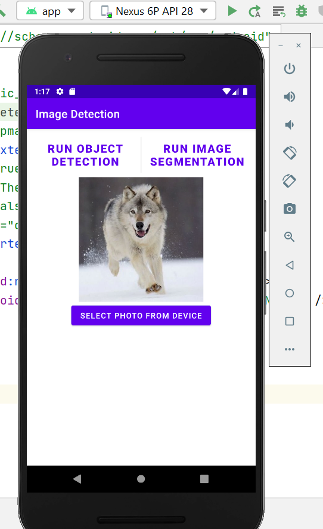
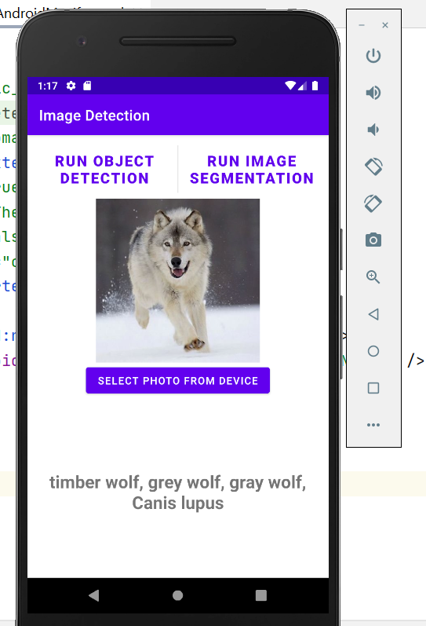
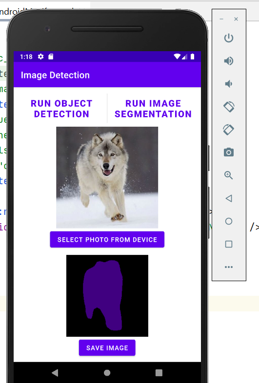

### Image Detection App

Date: 21.Jan.2022    
Android studio version 4.2.1  
Virtual machine: Nexus 6p API 28  
Deep Learning tool: pytorch  

for android API 28 and below, app need `External Storage` permission to save segmented image   
**trained model file is too big to upload github, scripted torch model should be in assets folder and set static variable-name of model- according to it**      

app main view  

 
after run object detection    

 
after run image segmentation  

 

ref. the app is created based on the pytorch android tutorial  

Object detection part is based on the torch helloworld tutorial   
https://pytorch.org/mobile/android/

Image segmentation part code from  
https://github.com/pytorch/android-demo-app/tree/master/ImageSegmentation
