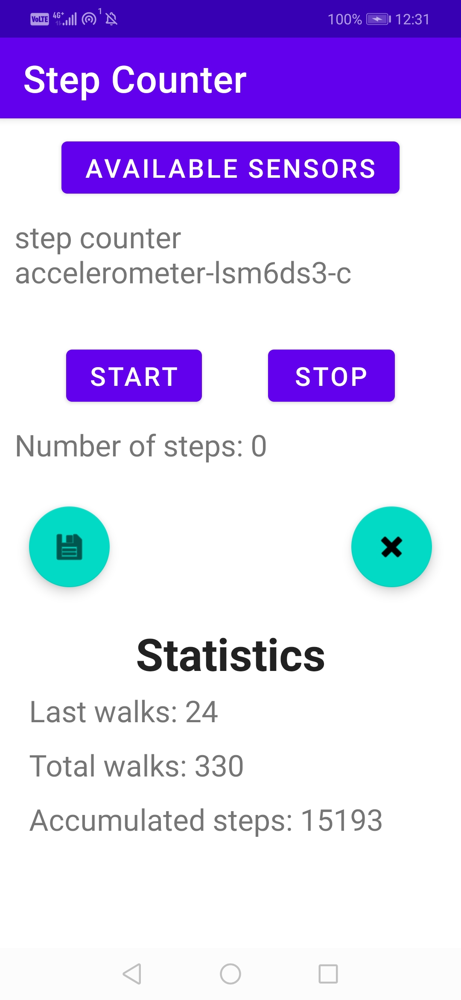

App step counter

Android Bumblebee 2011.1.1  
Date: 2022.March.30  
  
Test device: Huawei nova 3 (PAR-LX1)  
Android version 9 (EMUI version 9.1.0)  

Permission (AndroidManifest.xml): Android 10 and over
  - `<uses-permission android:name="android.permission.ACTIVITY_RECOGNITION" />`
  

Check available sensors for counting steps  
  - TYPE_STEP_COUNTER 
  - TYPE_STEP_DETECTOR
  - TYPE_ACCELEROMETER (=>not implemented, buy new phone...)
  

Features:  
  - display available sensors (TextView)
  - Start and stop button (Button)
  - show steps taken after starting (TextView) 
  - save currently taken steps (FloatingActionButton)
  - delete saved data (FloatingActionButton) 
  - statistics: display steps taken (lastly saved, sum of all saved steps)
  - if step_counter sensor is available, then accumulated number of steps (real-time) 
  - SharedPreference used to save data  
  
    
  
**MainActivity test view**    

<kbd>
   
</kbd>

  
   
 
  
ref:     
https://montemagno.com/part-1-my-stepcounter-android-step-sensors/  
https://hub.packtpub.com/step-detector-and-step-counters-sensors/  
https://programmerworld.co/android/how-to-create-walking-step-counter-app-using-accelerometer-sensor-and-shared-preference-in-android/  
https://www.geeksforgeeks.org/how-to-build-a-step-counting-application-in-android-studio/
